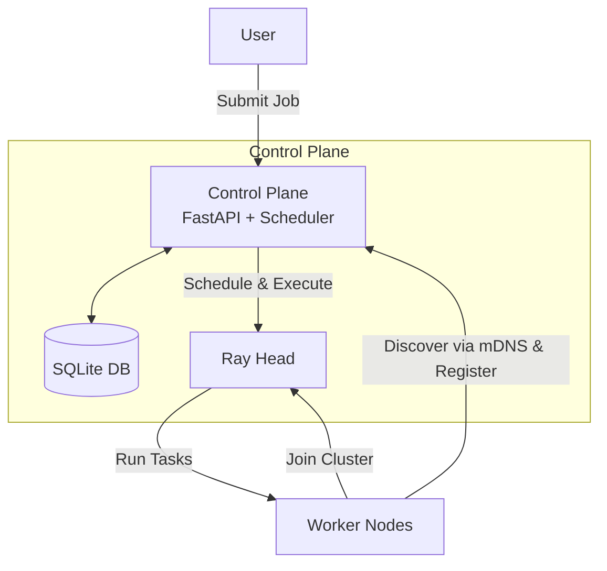

# Wano

Local-first compute orchestration for multi-node CPU/GPU workloads. Request abstract compute types, not specific devices. Automatic node discovery, distributed execution via Ray, self-hosted with no cloud dependency.



## CLI Commands

- `wano up` - Start the control plane (runs detached by default)
- `wano down` - Stop the control plane
- `wano join` - Register this machine as a worker node
- `wano status` - View cluster status and active jobs
- `wano run <script> --compute <cpu|gpu> [--gpus N] [--function NAME] [--args JSON] [--kwargs JSON]` - Submit and execute a job
- `wano build-executor [--requirements requirements.txt]` - Build the executor Docker image

## Python API

```python
import wano

@wano.function(compute="gpu", gpus=4)
def train():
    # Runs on 4 GPUs, potentially across multiple nodes
    ...

@wano.function(compute="cpu")
def preprocess():
    # Runs on CPU resources
    ...
```

## Executor Image

The executor image must include any Python dependencies used by your jobs.
Build it once per project and reuse it:

```
wano build-executor --requirements requirements.txt
```
